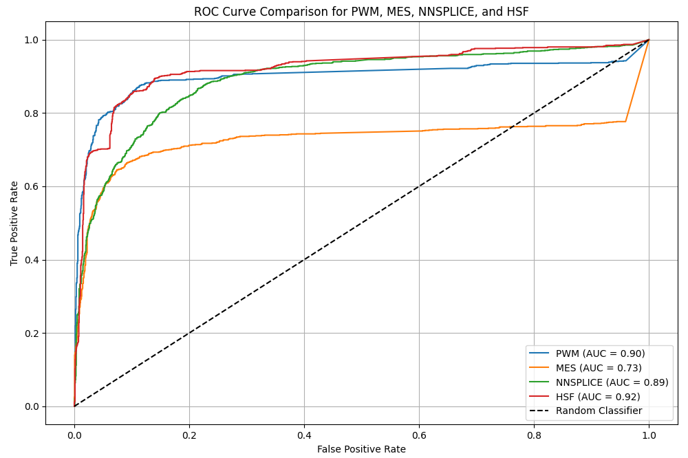

# Genomic Splice Analysis

A data analysis project focused on evaluating the performance of splicing prediction tools using ROC curves and AUC metrics. Built as part of the *Data Analysis* course, this project explores how well different bioinformatics models distinguish between positive and negative genetic samples.

---

## 📁 Dataset

- **File:** `S2.CSV`  
- **Samples:** Each row represents a genomic data point with scores from several splicing prediction tools.  
- **Labels:** The `Group` column specifies if a row is `Positive` or `Negative`.

---

## 🔍 Objectives

1. Handle and analyze missing values across tools.
2. Filter samples with non-missing top predictors.
3. Split data into train/test sets.
4. Compute classification performance using:
   - Confusion Matrix  
   - ROC Curve  
   - AUC Score
5. Compare predictive tools (`PWM`, `MES`, `NNSPLICE`, `HSF`) and determine the best one based on ROC AUC.

---

## 📈 Results Summary

- **Missing Rate Analysis**: Tools with the least missing data were selected for modeling.
- **Data Splitting**: Clean samples split into 90% train / 10% test.
- **Label Distribution**:
  - Positive and Negative rates were computed for each split.
- **Classification Logic**:
  - Ratio between `*_ref` and `*_alt` scores (e.g., `PWM_ratio`)
  - Simple threshold (e.g., >1) and best threshold from ROC
- **Performance Comparison**:
  - Best method based on AUC: **PWM**
  - ROC Curves were plotted for all methods.

---

## 📊 ROC Curve Figure

The ROC curves compare four models (PWM, MES, NNSplice, HSF):




---

## 🛠 How to Run the Project

1. Clone the repository:
   ```bash
   git clone https://github.com/mahmoudfiron/genomic-splice-analysis.git
   cd genomic-splice-analysis
